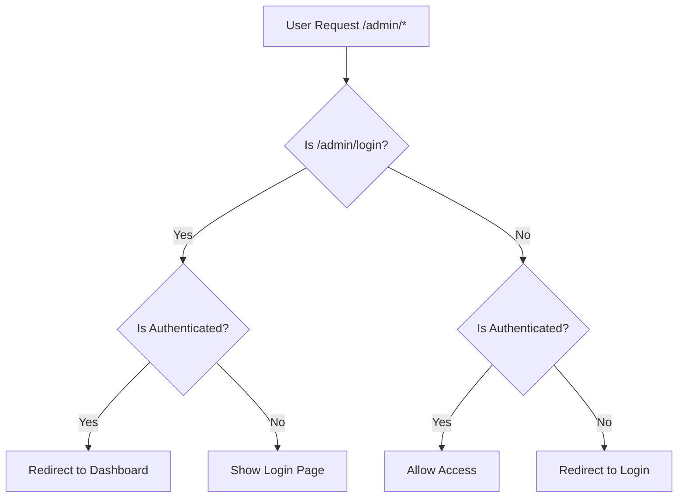

# 🔐 Admin Authentication System (Database-Based)

## 📋 Overview

Sistem autentikasi admin yang tersembunyi untuk mengelola website Desa Jambearum. Admin portal tidak terlihat di menu navigasi dan hanya bisa diakses melalui URL langsung. Kredensial admin disimpan di database PostgreSQL dengan password yang di-hash menggunakan bcrypt.

## 🚀 Cara Mengakses Admin

### 1. Login Admin
Akses: **`http://localhost:3000/admin/login`**

**Kredensial Default:**
- **Username:** `admin`
- **Password:** `jambearum2024!`

### 2. Dashboard Admin  
Setelah login berhasil, otomatis redirect ke: **`http://localhost:3000/admin/dashboard`**

## 🛡️ Security Features

### Authentication
- ✅ **Database-Stored Credentials** dengan bcrypt hashing
- ✅ **JWT Token** dengan expire 24 jam
- ✅ **HTTP-Only Cookies** untuk keamanan
- ✅ **Middleware Protection** pada semua route admin
- ✅ **Auto Redirect** jika belum login
- ✅ **Auto Redirect** ke dashboard jika sudah login
- ✅ **Last Login Tracking** tersimpan di database

### Route Protection
```
/admin/login     → Login page (public)
/admin/dashboard → Protected dashboard
/admin/umkm      → Protected UMKM management 
/admin/users     → Protected user management
/admin/*         → All protected by middleware
```

## 🎛️ Admin Dashboard Features

### 📊 Statistics Cards
- Total UMKM
- UMKM Aktif  
- Total Users
- Last Updated

### ⚡ Quick Actions
- **Kelola UMKM** - Manage UMKM businesses
- **Kelola Users** - Manage registered users
- **Lihat Website** - Return to main website

### 🔄 Session Management
- **24 hour** session duration
- **Auto logout** on token expiry
- **Manual logout** button
- **Secure cookie** handling

## 💾 Database Setup

### Admin Model
```prisma
model Admin {
  id        String   @id @default(cuid())
  username  String   @unique
  password  String   // Hashed with bcrypt
  email     String?  @unique
  name      String?
  role      String   @default("admin")
  isActive  Boolean  @default(true)
  lastLogin DateTime?
  createdAt DateTime @default(now())
  updatedAt DateTime @updatedAt
}
```

### Initialize Database
```bash
# Generate Prisma client
npm run db:generate

# Push schema to database
npm run db:push

# Seed default admin user
npm run db:seed
```

### Default Admin Credentials
Setelah menjalankan seeder, admin default akan dibuat dengan:
- **Username:** `admin`
- **Password:** `jambearum2024!` (hashed dengan bcrypt)
- **Email:** `admin@jambearum.desa.id`
- **Name:** `Administrator`

## 🔧 API Endpoints

### Authentication
```javascript
POST /api/admin/login
{
  "username": "admin",
  "password": "jambearum2024!"
}

POST /api/admin/logout
// Clears authentication cookie

GET /api/admin/me  
// Returns current admin user info

GET /api/admin/stats
// Get real-time statistics (protected)
```

### UMKM Management
```javascript
GET /api/admin/umkm
// Get all UMKM data (protected)

POST /api/admin/umkm
// Create new UMKM (protected)
{
  "name": "UMKM Name",
  "description": "Description",
  "category": "Category",
  "owner": "Owner Name", 
  "phone": "Phone Number",
  "address": "Address",
  "dusun": "Dusun Name",
  "products": ["Product 1", "Product 2"],
  "image": "image_url"
}
```

## 🔒 Security Configuration

### JWT Secret
Default: `jambearum-secret-key-2024`

**Untuk Production:**
Tambahkan ke `.env`:
```env
JWT_SECRET="your-super-secure-secret-key-here"
```

### Cookie Settings
- **HTTP-Only:** `true` (XSS protection)
- **Secure:** `true` in production (HTTPS only)
- **SameSite:** `lax` (CSRF protection)
- **MaxAge:** 24 hours

## 🚦 Middleware Flow



## 📝 Usage Examples

### 1. Login Process
```javascript
// Frontend login
const response = await fetch('/api/admin/login', {
  method: 'POST',
  headers: { 'Content-Type': 'application/json' },
  body: JSON.stringify({
    username: 'admin',
    password: 'jambearum2024!'
  })
})

const data = await response.json()
if (data.success) {
  // Redirect to dashboard
  router.push('/admin/dashboard')
}
```

### 2. Check Authentication
```javascript
// Check if user is authenticated
const response = await fetch('/api/admin/me')
if (response.ok) {
  const data = await response.json()
  console.log('Admin user:', data.user)
} else {
  // Not authenticated, redirect to login
  router.push('/admin/login')
}
```

### 3. Logout Process
```javascript
// Logout admin
const response = await fetch('/api/admin/logout', {
  method: 'POST'
})

if (response.ok) {
  router.push('/admin/login')
}
```

## 🛠️ Development

### Add New Admin User
```javascript
// Using Prisma Client
import { prisma } from '@/lib/prisma'
import { hashPassword } from '@/lib/auth'

const hashedPassword = await hashPassword('new_password')
await prisma.admin.create({
  data: {
    username: 'new_admin',
    password: hashedPassword,
    email: 'new_admin@jambearum.desa.id',
    name: 'New Administrator'
  }
})
```

### Reset Admin Password
```javascript
// Update existing admin password
const hashedPassword = await hashPassword('new_password')
await prisma.admin.update({
  where: { username: 'admin' },
  data: { password: hashedPassword }
})
```

### Extend Authentication
Untuk menambah admin baru atau role-based access:
1. Update database schema dengan admin table
2. Modify authentication functions
3. Add role-based middleware

## 🚨 Security Best Practices

### ✅ Implemented
- Database-stored credentials with bcrypt hashing (12 rounds)
- JWT with expiration
- HTTP-Only cookies
- CSRF protection (SameSite)
- Route-level protection
- Input validation
- Error handling
- Last login tracking
- Admin account management

### 🔄 Recommended for Production
- Environment variables for secrets
- Rate limiting on login attempts
- IP whitelisting 
- Audit logging
- Two-factor authentication
- Database-stored admin accounts

## 📞 Support

Jika ada masalah dengan sistem admin:

1. Pastikan credentials benar
2. Check browser cookies 
3. Restart development server
4. Clear browser cache
5. Check console logs

---

<div align="center">
<p><strong>🔐 Admin Portal - Desa Jambearum</strong></p>
<p>Secure • Hidden • Protected</p>
</div> 